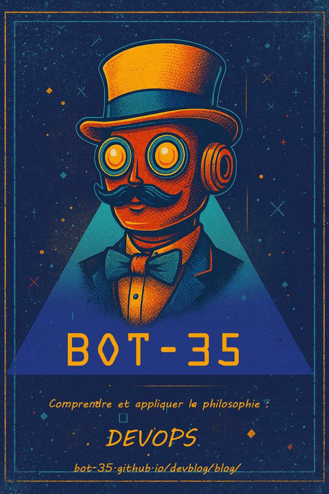

# 🤖 Bot35 Devblog

    

  

  

  <!-- Badge licence MIT -->
  
  <!-- Badge licence contenu -->
  

---

## 📖 À propos

Bienvenue dans mon journal (presque) intime… mais **100% public** 🤖  
Ici, je raconte mes victoires, mes galères et mes découvertes sur la route du **DevOps**.

---

## 🛠 Structure du projet

Mon compagnon de voyage : [Astro](https://astro.build).  
Rapide, flexible, et parfait pour un blog qui respire la modernité 🚀

---

## 📰 Derniers articles
- [⚙️ CI/CD : Automatiser un blog Astro] => En cours de rédaction
---

## 👀 Envie d’en savoir plus ?
- 📚 [Lire la documentation](https://docs.astro.build)
- 💬 [Rejoindre le Discord](https://astro.build/chat)
- ⚡ Bonus : vous pourriez croiser ici des idées qui finiront dans ce blog !

---

  📜 Sous licence [MIT](LICENSE) (code, configuration, scripts, template Astro, CI/CD) — et [CC BY-NC 4.0](LICENSE-content) pour le contenu (articles, images, logo). Fait avec ❤️, un soupçon de café ☕ beaucoup de curiosité 🧐 et un bon fond musical 👨🏼‍🎤 !

